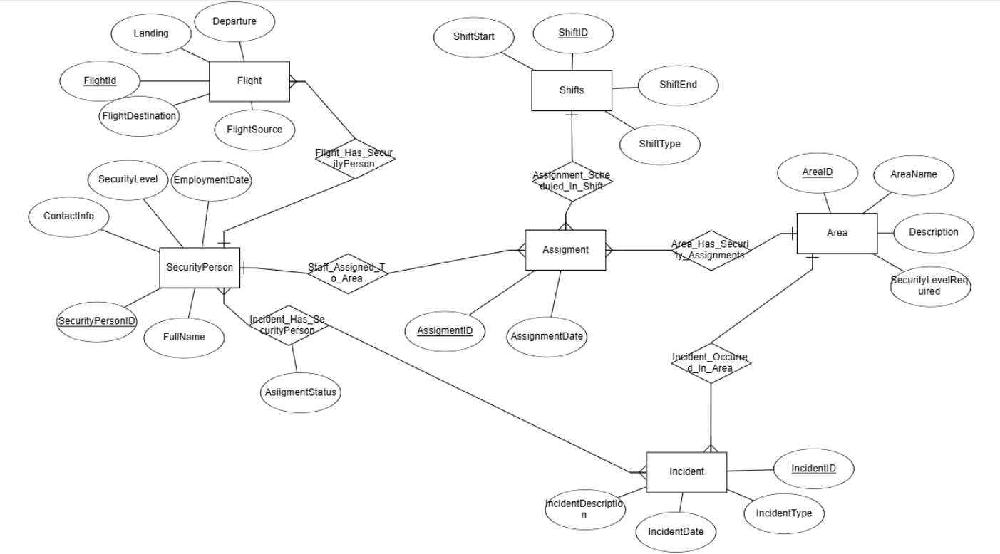
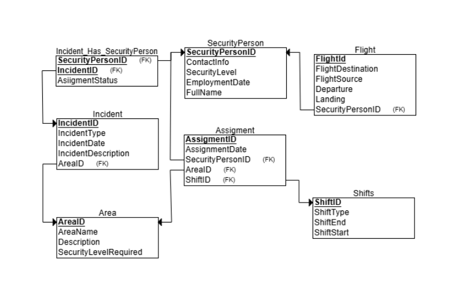

# DBProject_213204407_326254794

# Security Management Database

## Table of Contents 

- [Phase 1: Design and Build the Database](#phase-1-design-and-build-the-database)  
  - [Introduction](#introduction)  
  - [ERD (Entity-Relationship Diagram)](#erd-entity-relationship-diagram)  
  - [DSD (Data Structure Diagram)](#dsd-data-structure-diagram)  
  - [SQL Scripts](#sql-scripts)  
  - [Data](#data)
  - [Backup](#backup)  
- [Phase 2: Integration](#phase-2-integration)  

## Phase 1: Design and Build the Database  
### Introduction
The **Security Management Database** is designed to efficiently manage security personnel, secure areas, shifts, and incident records. This system ensures smooth operations by tracking security assignments, required security levels, and emergency incidents while maintaining a high level of organization and accessibility.

#### **Purpose of the Database**
This database serves as a structured and reliable solution for security organizations to:  
- **Manage security personnel** by tracking their experience, employment details, and security levels.  
- **Monitor secure areas** by maintaining information about locations and the required security levels.  
- **Assign security officers to shifts** based on availability and clearance levels.  
- **Track and record incidents** for reporting and operational improvements.  
- **Ensure compliance** with security regulations and maintain a history of security personnel activities.  

#### **Potential Use Cases**
- **Security Administrators** can use the database to schedule shifts, allocate personnel to secure areas, and track incidents.  
- **Security Personnel** can check their assigned shifts, work locations, and report incidents.  
- **Management & Investigators** can analyze security breaches, review personnel history, and generate reports on security performance.  
- **Emergency Response Teams** can quickly access real-time data to handle security incidents efficiently.  

This structured database helps streamline security operations, improving organization, compliance, and response times.
###  ERD (Entity-Relationship Diagram)    
  

###  DSD (Data Structure Diagram)   
  

###  SQL Scripts  
Provide the following SQL scripts:  
- **Create Tables Script** - The SQL script for creating the database tables is available in the repository:  
📜 **[View `create_tables.sql`](DBProject/partA/Scripts/SecurityCreateTable.sql)**  

- **Insert Data Script** - The SQL script for insert data to the database tables is available in the repository:  

📜 **[View `insert_tables.sql`](DBProject/partA/Scripts/SecurityInserts.sql)**  
 
- **Drop Tables Script** - The SQL script for droping all tables is available in the repository:  

📜 **[View `drop_tables.sql`](DBProject/partA/Scripts/SecurityDropTable.sql)**  

- **Select All Data Script**  - The SQL script for selectAll tables is available in the repository:  

📜 **[View `selectAll_tables.sql`](DBProject/partA/Scripts/SecuritySelectAll.sql)**  
  
###  Data  
####  First tool: using [mockaro](https://www.mockaroo.com/) to create csv file
#####  Entering a data to securityPerson table
📜[View `securityPerson_data.csv`](DBProject/partA/MockData/SecurityPerson.csv)
- formula of securityPersonID: \d{9}
- formula of ContactInfo : concat("05", random(10000000, 99999999))

results for  the command `SELECT COUNT(*) FROM Apotropus;`:
 

####  Second tool: using [generatedata](https://generatedata.com/generator). to create csv file 
#####  Entering a data to babyGroup table
-  Group Number  scope 1-400 
📜[View `babyGroupGenerateDat.csv`](Phase1/generateData/babyGroupGenerateData.csv)

results for  the command `SELECT COUNT(*) FROM BabyGroup;`:
 

#####  Entering a data to baby table
-  Bayby id scope 801-1200
-  Group Number  range 1-400

📜[View `babyGenerateDat.csv`](Phase1/generateData/babyGenerateData.csv)

results for  the command `SELECT COUNT(*) FROM Baby;`:
 

####  Third tool: using python to create csv file

### Backup 
-   backups files are kept with the date and hour of the backup:  

[עבור לתיקיית הגיבויים](Phase1/Backup)

## Phase 2: Integration 
