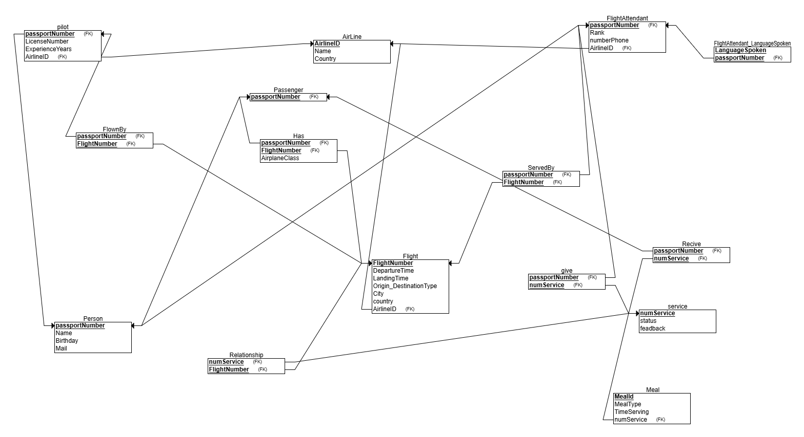

# DBProject_213204407_326254794

# Security Management Database

## Table of Contents 

- [Phase 1: Design and Build the Database](#phase-1-design-and-build-the-database)  
  - [Introduction](#introduction)  
  - [ERD (Entity-Relationship Diagram)](#erd-entity-relationship-diagram)  
  - [DSD (Data Structure Diagram)](#dsd-data-structure-diagram)  
  - [SQL Scripts](#sql-scripts)  
  - [Data](#data)
    - [First tool: using Mockaroo](#first-tool-using-mockaro-to-create-csv-file) 
    - [Second tool: using Generatedata](#second-tool-using-generatedata-to-create-csv-file)  
    - [Third tool: using Python](#third-tool-using-python-to-create-csv-file) 
  - [Backup_1](#backup_1)  
- [Phase 2: Queries](#phase-2-queries)
   - [Queries](#queries)
  - [Commit and Rollback](#commit-and-rollback)
  - [Checks](#checks)
  - [Backup_2](#backup_2)
- [Phase 3: Integration](#phase-3-integration)
  

## Phase 1: Design and Build the Database  
### Introduction
The **Security Management Database** is designed to efficiently manage security personnel, secure areas, shifts, and incident records. This system ensures smooth operations by tracking security assignments, required security levels, and emergency incidents while maintaining a high level of organization and accessibility.

#### **Purpose of the Database**
This database serves as a structured and reliable solution for security organizations to:  
- **Manage security personnel** by tracking their experience, employment details, and security levels.  
- **Monitor secure areas** by maintaining information about locations and the required security levels.  
- **Assign security officers to shifts** based on availability and clearance levels.  
- **Track and record incidents** for reporting and operational improvements.  
- **Ensure compliance** with security regulations and maintain a history of security personnel activities.  

#### **Potential Use Cases**
- **Security Administrators** can use the database to schedule shifts, allocate personnel to secure areas, and track incidents.  
- **Security Personnel** can check their assigned shifts, work locations, and report incidents.  
- **Management & Investigators** can analyze security breaches, review personnel history, and generate reports on security performance.  
- **Emergency Response Teams** can quickly access real-time data to handle security incidents efficiently.  

This structured database helps streamline security operations, improving organization, compliance, and response times.
###  ERD (Entity-Relationship Diagram)    
  

###  DSD (Data Structure Diagram)   
  

###  SQL Scripts  
Provide the following SQL scripts:  
- **Create Tables Script** - The SQL script for creating the database tables is available in the repository:  

     📌 **[View `create_tables.sql`](DBProject/partA/Scripts/SecurityCreateTable.sql)**  

- **Insert Data Script** - The SQL script for insert data to the database tables is available in the repository:  

    📌 **[View `insert_tables.sql`](DBProject/partA/Scripts/SecurityInserts.sql)**  
 
- **Drop Tables Script** - The SQL script for droping all tables is available in the repository:  

    📌 **[View `drop_tables.sql`](DBProject/partA/Scripts/SecurityDropTable.sql)**  

- **Select All Data Script**  - The SQL script for selectAll tables is available in the repository:  

    📌 **[View `selectAll_tables.sql`](DBProject/partA/Scripts/SecuritySelectAll.sql)**  
  
###  Data  
####  First tool: using [mockaro](https://www.mockaroo.com/) to create csv file
#####  Entering a data to securityPerson table
📌[View `securityPerson_data.csv`](DBProject/partA/MockData/SecurityPerson.csv)
- formula of securityPersonID: \d{9}
- formula of ContactInfo : concat("05", random(10000000, 99999999))

results for  the command `SELECT COUNT(*) FROM securityPerson;`:

####  Second tool: using [generatedata](https://generatedata.com/generator). to create csv file 
#####  Entering a data to shift table

  

results for  the command `SELECT COUNT(*) FROM shift;`:
 

####  Third tool: using python to create csv file

- Area Data:*
   
   📌 [View `area_data_code`](DBProject/partA/PythonData/area_data_python.py)
   
   📌 [View `area_data.csv`](DBProject/partA/PythonData/area.csv)
- Assigment Data:
   
    📌 [View `assigment_data_code`](DBProject/partA/PythonData/assignmentPython.py)
   
    📌 [View `assigment_data.csv`](DBProject/partA/PythonData/assignment.csv)
- IncidentHasSecurityPerson Data:
     
   📌 [View `incidentHasSecurityPerson_code`](DBProject/partA/PythonData/Incident_Has_SecurityPerson.py)
   
   📌 [View `incidentHasSecurityPerson.csv`](DBProject/partA/PythonData/Incident_Has_SecurityPerson.csv)
 - Flights Data:
     
   📌 [View `flights_code`](DBProject/partA/PythonData/flightPython.py)
    
   📌 [View `flights_data.csv`](DBProject/partA/PythonData/flights.csv)
   
  

### Backup_1
-   backups files are kept with the date and hour of the backup:  

[go to backups](DBProject/partA/Backup)

## Phase 2: Queries 

### [Queries](#queries)
📌[View Queries Code](DBProject/partB/Queries/Queries)

- Query 1: שאילתה למציאת כל המשמרות שבהן עובדים מאבטחים ברמה ביטחונית מסוימת

- Query 2:  שאילתה למציאת כל הטיסות בהן מאבטחים אחראים על טיסות, ומידע על המאבטח

- Query 3: השאילתה הזו מחזירה את המידע על מאבטחים שעבדו באזורים עם רמת ביטחון גבוהה 
                                                         כולל שם המאבטח, שם האזור, ומספר האירועים שהמאבטח היה מעורב בהם באותו האזור

- Query 4: השאילתה הזו מחפשת את כל המאבטחים שעבדו באזורים שבהם התרחשו יותר מ-3 אירועים,
                                                  סופרת את מספר האירועים לכל מאבטח בכל אזור, ומחזירה את שם המאבטח, שם האזור ומספר האירועים

- Query 5: השאילתה סופרת את מספר המשמרות שביצע כל מאבטח בטווח התאריכים ומחזירה את המידע ממוין לפי מספר המשמרות

- Query 6: השאילתה סופרת את מספר האירועים בכל חודש ושנה

- Query 7: השאילתה מחזירה את שמות המאבטחים שהיו מעורבים באירועים מסוג מסוים

- Query 8: השאילתה סופרת את מספר הטיסות שכל איש אבטחה איבטח

### [Commit and Rollback](#commit-and-rollback)

📌[View Commit and Rollback Code](DBProject/partB/Commit_Rollback/Commit_Rollback)

📌 Commit is a command used to finalize or save all the changes made during a transaction to the database.

- Commit 1: We added a new employee to the Security Person table and it was indeed saved.

- Commit 2: We updated the security level of a specific employee in the Security Person table and it was updated.

📌 Rollback is a command used to undo or cancel all changes made during a transaction if something goes wrong.

- RallBack 1: We deleted one area from the Area table and then rolled back and it was not deleted.

- RallBack 2: We updated an area name in the Area table and then rolled back and it was not updated.

### [Checks](#checks)

📌 The CHECK command in SQL is used to define constraints on values in a table's columns. It ensures that the data
    entered into the table meets specific conditions or rules.

📌[View Checks Code](DBProject/partB/Checks/Checks)

- Check 1: We checked that the security level in Area table is in the range between 1 and 5.

- Check 2: We checked the validity of the cell phone number in the Security Person table:
   it must start with the digits 05 and must have 10 digits.

- Check 3: We checked that the takeoff time in Flight table is less than the landing time.

### [Backup_2](#backup_2)

-   backups files are kept with the date and hour of the backup:  

[go to backups](DBProject/partB/Backup)

## Phase 3: Integration

### Introduction

בשלב זה ביצענו אינטגרציה בין המערכת שפיתחנו לבין מערכת נוספת של קבוצה אחרת. המטרה הייתה לשלב את בסיסי הנתונים בצורה לוגית ופיזית לכדי בסיס נתונים משותף, תוך כדי שמירה על תקינות הנתונים והקשרים.

### Process Overview

1. **DSD של האגף השני**  
   קיבלנו קובץ גיבוי של בסיס נתונים מקבוצה אחרת ומתוכו הפקנו את תרשים מבנה הנתונים (DSD).
   
  

3. **ERD של האגף השני**  
   מתוך ה-DSD שיחזרנו את תרשים ה-ERD באמצעות הינדוס לאחור.

4. **ERD משולב**  
   עיצבנו תרשים ERD משולב המשלב את שני הארגונים בצורה לוגית, לאחר שקיבלנו החלטות עיצוביות כיצד לבצע את השילוב.
   

5. **DSD משולב**  
   ייצרנו תרשים מבנה נתונים (DSD) מתוך המערכת החדשה לאחר השינויים, הכולל את כל הישויות והקשרים המעודכנים.

6. **שינויים בבסיס הנתונים (Integrate.sql)**  
   לא יצרנו מחדש את הטבלאות – השתמשנו בטבלאות הקיימות והשתמשנו בפקודות `ALTER TABLE`, `UPDATE`, ו-`DROP COLUMN` כדי להתאים את המבנה ל־ERD החדש.  
   לדוגמה:
   - המרה של המפתח הראשי של Person מ־passportNumber ל־PersonID
   - עדכון כל הטבלאות התלויות לשימוש ב־PersonID
   - הסרת שדות מיותרים כמו `passportNumber` ו־`numberPhone`
   - עדכון סוגי שדות ושמות עמודות (`Name_` ל־`FullName`, `Birthday` ל־`EmploymentDate`)

7. **קובץ Views.sql**  
   יצירת מבטים (views) בהתאם לדרישות החדשות ולצרכים של שילוב הנתונים.

8. **קובץ גיבוי מעודכן**  
   ייצאנו קובץ גיבוי חדש בשם `backup3` המכיל את בסיס הנתונים לאחר האינטגרציה.

9. **דוח שלב ג**  
   קובץ דוח עם הסברים, החלטות ותמונות של כל התרשימים.

