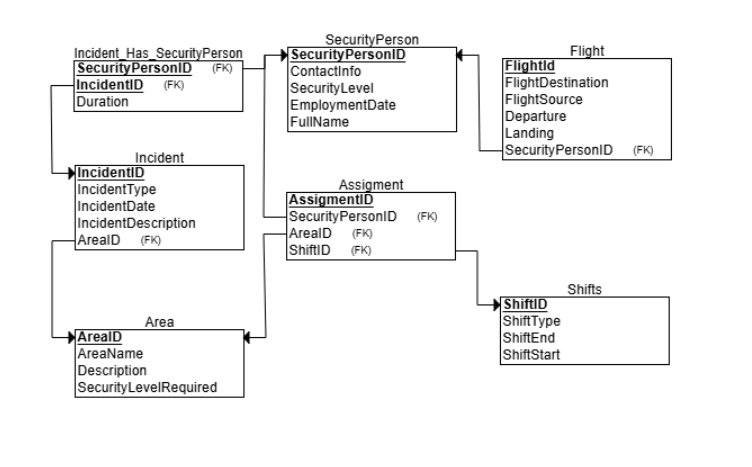
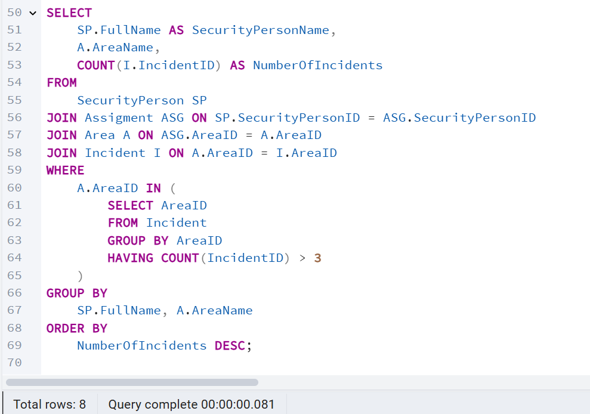
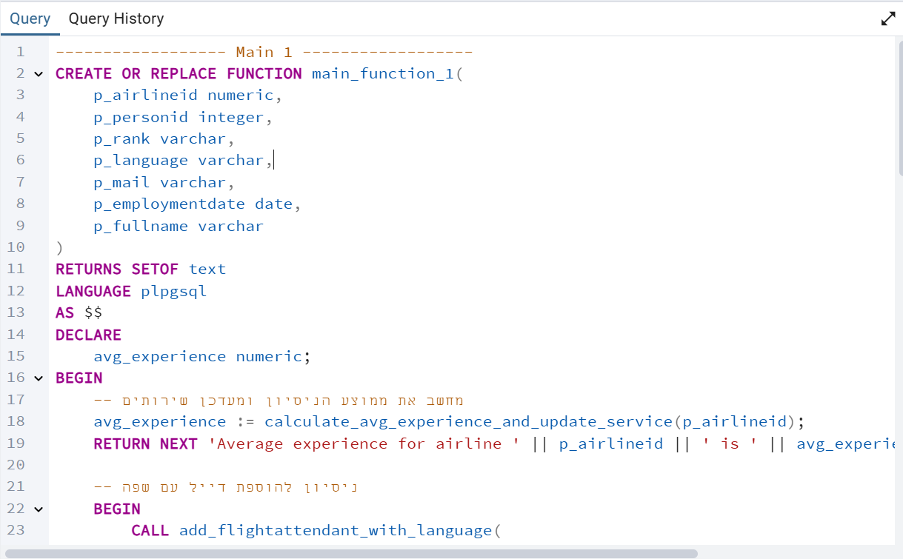

# DBProject_213204407_326254794

# Security Management Database

## Table of Contents 

- [Phase 1: Design and Build the Database](#phase-1-design-and-build-the-database)  
  - [Introduction](#introduction)  
  - [ERD (Entity-Relationship Diagram)](#erd-entity-relationship-diagram)  
  - [DSD (Data Structure Diagram)](#dsd-data-structure-diagram)  
  - [SQL Scripts](#sql-scripts)  
  - [Data](#data)
    - [First tool: using Mockaroo](#first-tool-using-mockaro-to-create-csv-file) 
    - [Second tool: using Generatedata](#second-tool-using-generatedata-to-create-csv-file)  
    - [Third tool: using Python](#third-tool-using-python-to-create-csv-file) 
  - [Backup_1](#backup_1)  
- [Phase 2: Queries](#phase-2-queries)
   - [Queries](#queries)
  - [Commit and Rollback](#commit-and-rollback)
  - [Checks](#checks)
  - [Backup_2](#backup_2)
- [Phase 3: Integration](#phase-3-integration)
  - [ה-DSD של האגף השני](#ה-DSD-של-האגף-השני)
  - [ה-ERD של האגף השני](#ה-ERD-של-האגף-השני)
  - [ה-ERD המשולב](#ה-ERD-המשולב)
  - [ה-DSD המשולב](#ה-DSD-המשולב)
  - [שינויים בבסיס הנתונים](#שינויים-בבסיס-הנתונים)
  - [מבטים](#מבטים)
  - [גיבוי 3](#גיבוי-3)
- [Phase 4: Programming](#phase-4-programming)
  - [Functions](#functions)
  - [Procedures](#procedures)
  - [Triggers](#triggers)
  - [Main](#main)
    
## Phase 1: Design and Build the Database  
### Introduction
The **Security Management Database** is designed to efficiently manage security personnel, secure areas, shifts, and incident records. This system ensures smooth operations by tracking security assignments, required security levels, and emergency incidents while maintaining a high level of organization and accessibility.

#### **Purpose of the Database**
This database serves as a structured and reliable solution for security organizations to:  
- **Manage security personnel** by tracking their experience, employment details, and security levels.  
- **Monitor secure areas** by maintaining information about locations and the required security levels.  
- **Assign security officers to shifts** based on availability and clearance levels.  
- **Track and record incidents** for reporting and operational improvements.  
- **Ensure compliance** with security regulations and maintain a history of security personnel activities.  

#### **Potential Use Cases**
- **Security Administrators** can use the database to schedule shifts, allocate personnel to secure areas, and track incidents.  
- **Security Personnel** can check their assigned shifts, work locations, and report incidents.  
- **Management & Investigators** can analyze security breaches, review personnel history, and generate reports on security performance.  
- **Emergency Response Teams** can quickly access real-time data to handle security incidents efficiently.  

This structured database helps streamline security operations, improving organization, compliance, and response times.
###  ERD (Entity-Relationship Diagram)    
  

###  DSD (Data Structure Diagram)   
  

###  SQL Scripts  
Provide the following SQL scripts:  
- **Create Tables Script** - The SQL script for creating the database tables is available in the repository:  

     📌 **[View `create_tables.sql`](DBProject/partA/Scripts/SecurityCreateTable.sql)**  

- **Insert Data Script** - The SQL script for insert data to the database tables is available in the repository:  

    📌 **[View `insert_tables.sql`](DBProject/partA/Scripts/SecurityInserts.sql)**  
 
- **Drop Tables Script** - The SQL script for droping all tables is available in the repository:  

    📌 **[View `drop_tables.sql`](DBProject/partA/Scripts/SecurityDropTable.sql)**  

- **Select All Data Script**  - The SQL script for selectAll tables is available in the repository:  

    📌 **[View `selectAll_tables.sql`](DBProject/partA/Scripts/SecuritySelectAll.sql)**  
  
###  Data  
####  First tool: using [mockaro](https://www.mockaroo.com/) to create csv file
#####  Entering a data to securityPerson table
📌[View `securityPerson_data.csv`](DBProject/partA/MockData/SecurityPerson.csv)
- formula of securityPersonID: \d{9}
- formula of ContactInfo : concat("05", random(10000000, 99999999))

results for  the command `SELECT COUNT(*) FROM securityPerson;`:

####  Second tool: using [generatedata](https://generatedata.com/generator). to create csv file 
#####  Entering a data to shift table

  

results for  the command `SELECT COUNT(*) FROM shift;`:
 

####  Third tool: using python to create csv file

- Area Data:*
   
   📌 [View `area_data_code`](DBProject/partA/PythonData/area_data_python.py)
   
   📌 [View `area_data.csv`](DBProject/partA/PythonData/area.csv)
- Assigment Data:
   
    📌 [View `assigment_data_code`](DBProject/partA/PythonData/assignmentPython.py)
   
    📌 [View `assigment_data.csv`](DBProject/partA/PythonData/assignment.csv)
- IncidentHasSecurityPerson Data:
     
   📌 [View `incidentHasSecurityPerson_code`](DBProject/partA/PythonData/Incident_Has_SecurityPerson.py)
   
   📌 [View `incidentHasSecurityPerson.csv`](DBProject/partA/PythonData/Incident_Has_SecurityPerson.csv)
 - Flights Data:
     
   📌 [View `flights_code`](DBProject/partA/PythonData/flightPython.py)
    
   📌 [View `flights_data.csv`](DBProject/partA/PythonData/flights.csv)
   
  

### Backup_1
-   backups files are kept with the date and hour of the backup:  

[go to backups](DBProject/partA/Backup)

## Phase 2: Queries 

### [Queries](#queries)
📌[View Queries Code](DBProject/partB/Queries/Queries)

- Query 1: שאילתה למציאת כל המשמרות שבהן עובדים מאבטחים ברמה ביטחונית מסוימת
  

- Query 2:  שאילתה למציאת כל הטיסות בהן מאבטחים אחראים על טיסות, ומידע על המאבטח
  

- Query 3: השאילתה הזו מחזירה את המידע על מאבטחים שעבדו באזורים עם רמת ביטחון גבוהה 
                                                         כולל שם המאבטח, שם האזור, ומספר האירועים שהמאבטח היה מעורב בהם באותו האזור

- Query 4: השאילתה הזו מחפשת את כל המאבטחים שעבדו באזורים שבהם התרחשו יותר מ-3 אירועים,
                                                  סופרת את מספר האירועים לכל מאבטח בכל אזור, ומחזירה את שם המאבטח, שם האזור ומספר האירועים

- Query 5: השאילתה סופרת את מספר המשמרות שביצע כל מאבטח בטווח התאריכים ומחזירה את המידע ממוין לפי מספר המשמרות
  

- Query 6: השאילתה סופרת את מספר האירועים בכל חודש ושנה
  

- Query 7: השאילתה מחזירה את שמות המאבטחים שהיו מעורבים באירועים מסוג מסוים
  

- Query 8: השאילתה סופרת את מספר הטיסות שכל איש אבטחה איבטח
  

**delete and update queries**

📌[View Delete And Update Queries Code](DBProject/partB/Queries/DeleteAndUpdateQueris)

🔹Delete Queries:
  
  - Query 1: מחיקת אנשי אבטחה שלא שובצו לשום משמרת, לא היו בטיסות, ולא השתתפו באירועים
    
   

  - Query 2: מחיקת טיסות שבהן שובץ איש אבטחה עם רמת אבטחה נמוכה מ־2
    
   

  - Query 3: מחיקת כל השיבוצים של מאבטחים שהוצבו באותו אזור ביותר ממשמרת אחת
    
    

🔹Update Queries:

 - Query 1: העלאת דרגת אבטחה למאבטחים שטיפלו באירועים באזורים ברמת אבטחה גבוהה מ־4 וקטנה מ-5

   
   
 - Query 2: עדכון אזורים: הוספת "אזור חם" לשם של אזורים שבהם התרחשו יותר מ־3 אירועים

   

 - Query 3: עדכון אנשי אבטחה: הוספת ותק לשם של מאבטחים שעובדים יותר מ־5 שנים

    

   

    
   

### [Commit and Rollback](#commit-and-rollback)

📌[View Commit and Rollback Code](DBProject/partB/Commit_Rollback/Commit_Rollback)

📌 Commit is a command used to finalize or save all the changes made during a transaction to the database.

- Commit 1: We added a new employee to the Security Person table and it was indeed saved.

- Commit 2: We updated the security level of a specific employee in the Security Person table and it was updated.

📌 Rollback is a command used to undo or cancel all changes made during a transaction if something goes wrong.

- RallBack 1: We deleted one area from the Area table and then rolled back and it was not deleted.

- RallBack 2: We updated an area name in the Area table and then rolled back and it was not updated.

### [Checks](#checks)

📌 The CHECK command in SQL is used to define constraints on values in a table's columns. It ensures that the data
    entered into the table meets specific conditions or rules.

📌[View Checks Code](DBProject/partB/Checks/Checks)

- Check 1: We checked that the security level in Area table is in the range between 1 and 5.

- Check 2: We checked the validity of the cell phone number in the Security Person table:
   it must start with the digits 05 and must have 10 digits.

- Check 3: We checked that the takeoff time in Flight table is less than the landing time.

### [Backup_2](#backup_2)

-   backups files are kept with the date and hour of the backup:  

[go to backups](DBProject/partB/Backup)

## Phase 3: Integration

### Introduction

בשלב זה ביצענו אינטגרציה בין המערכת שפיתחנו לבין מערכת נוספת של קבוצה אחרת. המטרה הייתה לשלב את בסיסי הנתונים בצורה לוגית ופיזית לכדי בסיס נתונים משותף, תוך כדי שמירה על תקינות הנתונים והקשרים.

### Process Overview

### **ה-DSD של האגף השני**

קיבלנו קובץ גיבוי של בסיס נתונים מקבוצה אחרת ומתוכו הפקנו את תרשים מבנה הנתונים.
   
  

### **ה-ERD של האגף השני**

   מתוך ה-DSD שיחזרנו את תרשים ה-ERD באמצעות הינדוס לאחור.
 
### **ה-ERD המשולב**

   עיצבנו תרשים ERD משולב המשלב את שני הארגונים בצורה לוגית, לאחר שקיבלנו החלטות עיצוביות כיצד לבצע את השילוב.
    בין היתר ביצענו את השינויים הבאים:
   - איחדנו שתי טבלאות `Flight` שהופיעו אצל כל קבוצה, תוך שמירה על שדות רלוונטיים מכל אחת וביטול כפילויות.
   - הפכנו את הישות `SecurityPerson` ליורשת של `Person`, על מנת למנוע כפילויות ולנצל את המבנה הכללי של בני אדם במערכת.
   - איחדנו מספר קשרים מסוג רבים־לרבים שהיו מחוברים לישויות השונות היורשות מ־`Person`, כך שייצרו קשר אחד כללי עם `Person`.
   - הוספנו עמודת "תחילת עבודה" (EmploymentDate) בישות `Person` כדי לייצג את תאריך ההתחלה של מאבטחים, והסרנו את אותה עמודה מ־`SecurityPerson`.
   
   את שלבי האיחוד והשינויים נציג בהמשך בפירוט בעת הצגת קובץ `Integrate.sql`.

 
### **ה-DSD המשולב** 

   ייצרנו תרשים מבנה נתונים (DSD) מתוך המערכת החדשה לאחר השינויים, הכולל את כל הישויות והקשרים המעודכנים.
    
    בנוסף, יצרנו את ה-ERD המשותף מתוך התוכנה.
      

### **שינויים בבסיס הנתונים**  
   לא יצרנו מחדש את הטבלאות – השתמשנו בטבלאות הקיימות והשתמשנו בפקודות `ALTER TABLE`, `UPDATE`, ו-`DROP COLUMN` כדי להתאים את המבנה ל־ERD החדש.  
   

חילקנו את העבודה לכמה קבצים לפי שלבים ברורים, כאשר השלב הראשון היה להמיר את העמודה `passportNumber` בטבלת Person למפתח הראשי החדש `PersonID` מסוג `SERIAL`.  

הסבר על התהליך של המרת העמודה:
-  הסרנו את כל הקשרים הזרים (foreign keys) שהתבססו על `passportNumber` בטבלאות המקושרות ל- `Person`.
-  הסרנו את המפתח הראשי הישן מטבלת `Person`, ועדכנו את העמודה `Birthday` עם ערכים אקראיים (בהתאם לגיל ריאלי לתחילת עבודה) ושינינו את שמה ל-EmploymentDate. בנוסף, שינינו שמות וגדלים של עמודות בהתאם לעיצוב החדש (`Name_` ל־`FullName`, ו־`Mail` ל־VARCHAR(50)).  
-  הוספנו עמודת `PersonID` מסוג `SERIAL` כ־Primary Key חדש בטבלת `Person`.
-  עדכנו כל אחת מטבלאות הירושה (`Passenger`, `Pilot`, `FlightAttendant`) כך שישתמשו ב־`PersonID` במקום `passportNumber`, כולל הוספת קשרים זרים חדשים והגדרה של `PersonID` כמפתח ראשי.
-  עדכנו את כל הטבלאות המקושרות הנוספות (כמו `Has`, `ServedBy`, `FlownBy`, `Recive`, `Give`, ועוד) כך שישתמשו ב־`PersonID` במקום `passportNumber`, תוך שמירה על תקינות של קשרים זרים.
-  מחקנו את העמודה `passportNumber` מטבלת `Person`, כך שלא תהיה כפילות.
-  קבענו שערך `EmploymentDate` יהיה `NULL` עבור נוסעים (שלא נחשבים עובדים בארגון), ועדכנו אותו בהתאם. בנוסף, הסרנו עמודות מיותרות כמו `numberPhone` מהטבלה `FlightAttendant`.

📌 [View `part1`](DBProject/partC/IntegrateSql/part1_Integrate_from_person)

לאחר שסיימנו להמיר את Person ולהתאים את כל הטבלאות לתמוך ב-PersonID כמפתח הראשי, בשלב הבא התמקדנו בהורשת SecurityPerson מ-Person כדי לאחד את המידע ולשפר את מבנה בסיס הנתונים.

הסבר על התהליך של הורשת SecurityPerson מ-Person:
- מוסיפים לעמודת SecurityPerson את העמודה PersonID כדי לקשר ל-Person.
- מכניסים רשומות חדשות לטבלת Person מהנתונים הקיימים ב-SecurityPerson.
- מעדכנים את העמודה PersonID ב-SecurityPerson לפי ההתאמה בין השמות והאימיילים בטבלת Person.
- מוסיפים עמודת PersonID לטבלאות התלויות (כמו Assigment, flight1 ו-Incident_Has_SecurityPerson) ומעדכנים את הערכים לפי SecurityPerson.
- מסירים את המפתחות הזרים הישנים שמצביעים על SecurityPersonID בטבלאות התלויות.
- מורידים את המפתח הראשי הישן בטבלת SecurityPerson (SecurityPersonID) כדי לאפשר PersonID להיות המפתח הראשי החדש.
- מגדירים את PersonID כמפתח ראשי חדש בטבלת SecurityPerson, ומוסיפים מפתח זר שמפנה לטבלת Person.
- מוסיפים מפתחות זרים חדשים בטבלאות התלויות, שמצביעות על PersonID במקום SecurityPersonID.
- מוחקים את עמודות SecurityPersonID הישנות מטבלאות התלויות.
- מוחקים עמודות מיותרות בטבלת SecurityPerson — כולל FullName, EmploymentDate ו-SecurityPersonID — כי הן כבר בטבלת Person.
 
 📌 [View `part2`](DBProject/partC/IntegrateSql/part2_Implement_inheritance)

חלק מההתאמות למבנה החדש, איחדנו את הטבלאות הרבות המקשרות בין עובדים שונים לטיסה לטבלה בשם PersonInFlight, כדי לנהל בצורה גמישה וברורה יותר את כל התפקידים של אנשים בטיסה.
-מוסיפים לטבלה Has עמודת Role שמייצגת את תפקיד האדם בטיסה, עם ערך ברירת מחדל 'Passenger'.
- משנים את עמודת AirplaneClass בטבלה Has כך שתוכל לקבל ערך NULL, כלומר תהיה אופציונלית.
- מסירים את המפתח הזר הישן שמגביל את PersonID בטבלה Has רק לנוסעים.
- מוסיפים מפתח זר חדש לטבלה Has שמאפשר ל-PersonID להפנות לכל סוג של אדם (נוסע, טייס, דייל וכו') מטבלת Person.
- מעתיקים רשומות של דיילים (FlightAttendants) מטבלת ServedBy לטבלה Has, ומגדירים את התפקיד כ-'FlightAttendant'.
- מעתיקים רשומות של טייסים (Pilots) מטבלת FlownBy לטבלה Has, ומגדירים את התפקיד כ-'Pilot'.
- מוחקים את הטבלאות הישנות ServedBy ו-FlownBy שהפכו מיותרות.
- משנים את שם הטבלה Has ל-PersonInFlight כדי לשפר את הבהירות והקריאות של הטבלה.

 📌 [View `part3`](DBProject/partC/IntegrateSql/part3_MergingThreeConnectors)
 
כעת אנחנו רוצות לאחד את טבלאות flight
- הוספת עמודת FlightId לטבלת OUR_FLIGHT – הוספנו עמודה חדשה שתשמש כמפתח ראשי ייחודי מסוג INTEGER.
- קביעת ערך התחלתי לעמודת FlightId בהתבסס על טבלת Flight1 – מצאנו את המספר הגבוה ביותר של FlightId בטבלה Flight1 כדי לקבוע את הערך הבא שיוקצה.
- יצירת סדרת מספרים (sequence) עבור FlightId – יצרנו סדרה שמתחילה מהמספר שנמצא בשלב הקודם, כדי לייצר ערכי מפתח חדשים.
- עדכון כל הרשומות בטבלת OUR_FLIGHT לקבלת ערך FlightId מתוך הסדרה – מילאנו את הערכים החדשים בעמודה.
- הוספת עמודת FlightID לטבלאות Relationship ו־PersonInFlight – כדי לקשר אותן לטבלת הטיסות החדשה.
- עדכון עמודת FlightID בטבלאות Relationship ו־PersonInFlight לפי טבלת OUR_FLIGHT – העברת הקשר בין טבלאות בהתבסס על הטבלה הראשית.
- מחיקת המפתחות הזרים הישנים שנקשרו לעמודת FlightNumber – כדי לפנות מקום למפתחות החדשים.
- מחיקת עמודת FlightNumber מטבלאות Relationship ו־PersonInFlight – העמודה הישן הוסרה כי היא לא רלוונטית יותר.
- הגדרת FlightId כמפתח הראשי החדש של טבלת OUR_FLIGHT – במקום FlightNumber שהיה קודם.
- הוספת מפתחות זרים חדשים בטבלאות Relationship ו־PersonInFlight שמפנים ל־FlightId בטבלת OUR_FLIGHT – כדי לשמור על תקינות הקשרים.
- הוספת עמודות FlightSource ו־FlightDestination לטבלת OUR_FLIGHT – להרחבת מידע על מקור ויעד הטיסה.
- מחיקת עמודות **מיותרות** מטבלת OUR_FLIGHT – כמו FlightNumber, Origin_DestinationType ו־City.
- עדכון עמודת FlightSource עם ערכים מתוך העמודה country – העברת מידע מהעמודה הישנה לעמודה החדשה.
- מחיקת עמודת country מטבלת OUR_FLIGHT – לאחר העברת הנתונים.
- הוספת עמודת personId לטבלת OUR_FLIGHT לצורך קשר זר – לקשר לטבלת securityPerson.
- הגדרת קשר זר בין personId בטבלת OUR_FLIGHT לטבלת securityPerson – לשמירת קשר תקין בין טבלאות.
- הוספת יעד טיסה אקראי (FlightDestination) מתוך רשימה מוגדרת, כאשר היעד שונה ממקור הטיסה – לצורך השלמת הנתונים.
- אפשרנו שעמודת AirlineID בטבלת OUR_FLIGHT תהיה אופציונלית (NULL) – הסרנו את ההגבלה על ערך חובה.
- הכנסת נתונים מטבלת Flight1 לטבלת OUR_FLIGHT – העתקה של הטיסות הקיימות עם השדות הרלוונטיים.
- עדכון רשומות בטבלת OUR_FLIGHT שבהן AirlineID הוא NULL, עם ערכים אקראיים מטבלת AirLine – למילוי שדות חסרים.
- הכנסת רשומות של אנשים בטיסות (SecurityPerson) לטבלה PersonInFlight עם תפקידים מתאימים – הוספת נתונים על תפקידים שונים בטיסה.
- מחיקת עמודת PersonID מטבלת OUR_FLIGHT – לאחר שהמידע הועבר והקשרים עודכנו.
- מחיקת טבלת Flight1 – טבלה זו הפכה מיותרת לאחר העברת כל הנתונים.
- שינוי שם טבלת OUR_FLIGHT ל־FLIGHT – לשם קצר וברור יותר.

 📌 [View `part4`](DBProject/partC/IntegrateSql/part4_mergingFlightTables)
 
### **מבטים**  
   **מבט 1: IncidentDetails**

   מבט על מסד הנתונים המקורי.

🔹 תיאור המבט:

מבט זה מאגד מידע על תקריות (Incidents), כולל סוג התקרית, תיאורה, תאריך התרחשותה, שם האזור בו קרתה, שם איש האבטחה שהיה נוכח ומשך המעורבות שלו בתקרית.

 
 שאילתות על המבט:

🔸 שאילתה 1: שליפת כל התקריות מסוג Vandalism (ונדליזם).

 

 🔸 שאילתה 2: שליפת כל התקריות שהתרחשו לאחר 1 בינואר 2024.

 
 **מבט 2: PassengerFlightInfo**

מבט על מסד הנתונים שקיבלנו מזוג אחר בקבוצה

🔹 תיאור המבט:

מבט זה מרכז מידע על נוסעים, כולל שמם המלא, מחלקת הטיסה שלהם, מספר הטיסה, יעד ההמראה והנחיתה, וזמן ההמראה.

 
 
 🔸 שאילתה 1: שליפת שמות של נוסעים שטסים במחלקה ראשונה.

 
 
 🔸 שאילתה 2: שליפת כל הטיסות שהיעד שלהן הוא תל אביב.

 
 
 📌 [View the views](DBProject/partC/Views/Code/views)

### **גיבוי 3**  
   ייצאנו קובץ גיבוי חדש בשם `backup3` המכיל את בסיס הנתונים לאחר האינטגרציה.

   [go to backup](DBProject/partC/Backup)

## Phase 4: Programming
### [Functions](#functions)
🔸 פונקציה 1: הפונקציה מחשבת את ממוצע שנות הניסיון של הטייסים בחברת תעופה מסוימת ומעדכנת את טבלת השירותים הפעילים עם משוב בהתאם לרמת הניסיון.

🔸 פונקציה 2: הפונקציה מחזירה מצביע לטייסים המשויכים לטיסה מסוימת, כולל פרטים כמו מזהה אדם, שם מלא, שנות ניסיון ומזהה חברת התעופה שלהם.

📌 [View the functions](DBProject/partD/Codes/functions)

### [Procedures](#procedures)

🔸 פרוצדורה 1: הפרוצדורה מוסיפה דייל טיסה חדש עם שפה מדוברת, או אם הדייל כבר קיים – מוסיפה לו שפה חדשה, תוך בדיקות למניעת כפילויות וודא שהאדם קיים בטבלת `person` לפני הוספתו כדייל.

🔸 פרוצדורה 2: הפרוצדורה מוחקת אירוע מסוים יחד עם כל הקצאות האבטחה הקשורות אליו, לאחר בדיקה שהאירוע קיים במערכת.

📌 [View the procedures](DBProject/partD/Codes/procedures)

### [Triggers](#triggers)

🔸 טריגר 1: הטריגר `trg_flightattendant_insert` מופעל לאחר הוספה של שורה חדשה בטבלת `flightattendant`, ורושם את פרטי הדייל שנוסף בטבלת הלוג `flightattendant_insert_log`, תוך הצגת הודעה עם פרטי ההוספה.

כדי לראות את הטבלה שנוצרה רשמנו כך:

🔸 טריגר 2: הטריגר מופעל לאחר שנמחקת רשומה מטבלת incident, ומפעיל את הפונקציה trg_incident_delete_notice, אשר מציגה הודעת NOTICE עם מספר האירוע (incidentid) שנמחק.
את התוצאה ניתן לראות בתמונה של ההרצה של התכנית השנייה שנמצאת בהמשך.

📌 [View the triggers](DBProject/partD/Codes/triggers)

### [Main](#main)

🔸תכנית 1: הפונקציה main_function_1 מבצעת שני שלבים עיקריים:

  - מחשבת את ממוצע שנות הנסיון של טייסים בחברת התעופה ומעדכנת בהתאם את טבלת השירותים, ומחזירה הודעה עם הממוצע.

  - מנסה להוסיף דייל טיסה עם שפה חדשה, ומחזירה הודעה על הצלחה או כישלון בתהליך ההוספה.

    קוד התכנית:

    
    

    

  כדי להריץ את הפונקציה השתמשנו בקטע הקוד הבא:
  

כפי שניתן לראות, הדייל נוסף בהצלחה עם השפה החדשה והממוצע חושב בהצלחה.

בהמשך ניסינו להוסיף את אותו הדייל עם אותה השפה שוב, מה שגרם לשגיאה מאחר שזה אינו תקין. התוצאה שהתקבלה מוצגת כאן:

🔸תכנית 2: הפונקציה main_function_2  מבצעת שני שלבים עיקריים:

  - מוחקת אירוע אבטחה מסוים ואת כל ההקצאות הקשורות אליו באמצעות קריאה לפרוצדורה delete_incident_and_security_assignments.
  
  - מביאה את רשימת הטייסים המשויכים לטיסה מסוימת בעזרת הפונקציה get_pilots_for_flight, ומציגה הודעה עם פרטי כל טייס שנמצא.
 
    קוד התכנית:

  כדי להריץ את הפונקציה השתמשנו בקטע הקוד הבא:

      

כפי שניתן לראות, האירוע נמחק בהצלחה ופרטי הטייס הודפסו.

בהמשך ניסינו למחוק אירוע שלא קיים, מה שגרם לשגיאה מאחר שזה אינו תקין. התוצאה שהתקבלה מוצגת כאן:

📌 [View the main](DBProject/partD/Codes/main)

